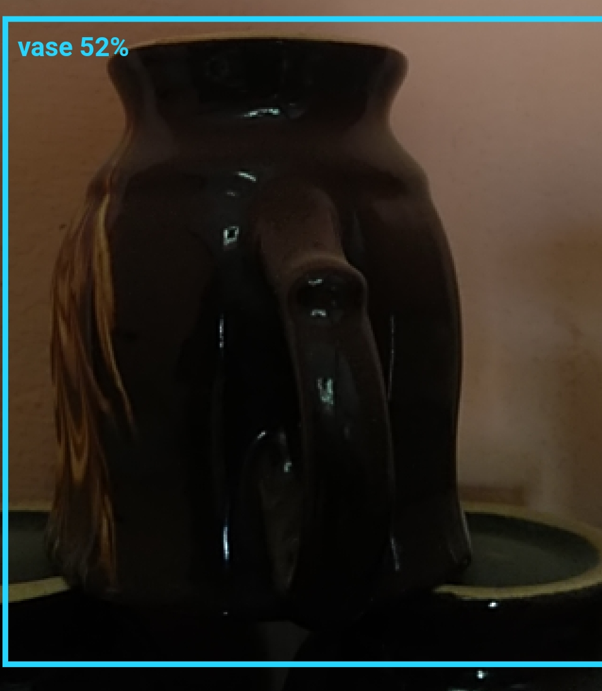

# Flutter Space

An App for Blind People which speaks whatever the object is in front of them.

## Feature

<ul><li>Detection of Object </li></ul>
<ul><li>Speak the Object Name if Confidence in Class is greater than 50 </li></ul>



## Installation

How to install Android Studio
```bash
https://developer.android.com/studio
```
OR

How to install Visual Studio Code
```bash
https://code.visualstudio.com/
```

Clone this repository and import into **Android Studio**
```bash
https://github.com/DSC-IIIT-Surat/FlutterSpace
```

## Contributing 

Contributions are welcome! However, if it's going to be a major change, please create an issue first. Before starting to work 
on something, please comment on a specific issue and say you'd like to work on it.

